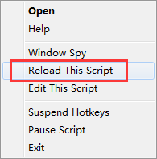

# autohotkey-scripts
Repository for saving my .ahk files.

## How To Use It In One Minute
### Step 1
**Download AutoHotkey Installer or .zip**

[download here](https://autohotkey.com/download/)

> if download Installer, install it; if `.zip`, just unzip it.

### Step 2
**Download `alex.ahk`, then double-click it (it will run the script)**

### Step 3
**You can use code editor to view this `alex.ahk` file**

Simple explanation here:
```ahk
:*:[b::  ;press key: [+b
Send, browser-sync start --server --files "**" ;it will automatically type 'browser-sync start --server --files' for you
Return

:*:[d::  ;press key: [+d
Send, docsify serve docs ;it will automatically type 'docsify serve docs' for you
Return
```

> Just like that, you can add your own rules. If you edit the file while running, you should right click the running script at your system's notification area, then click `Reload This Script` to make it works.



